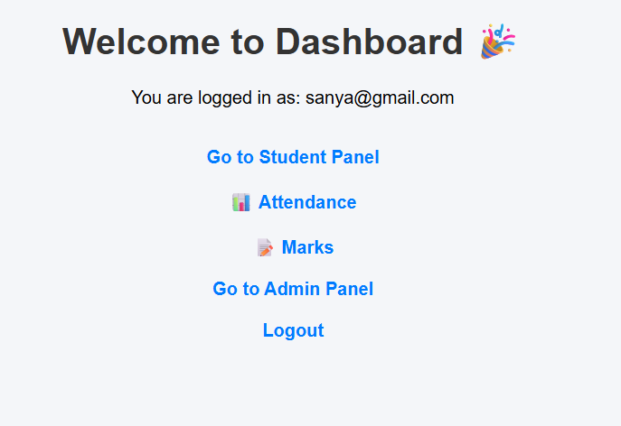
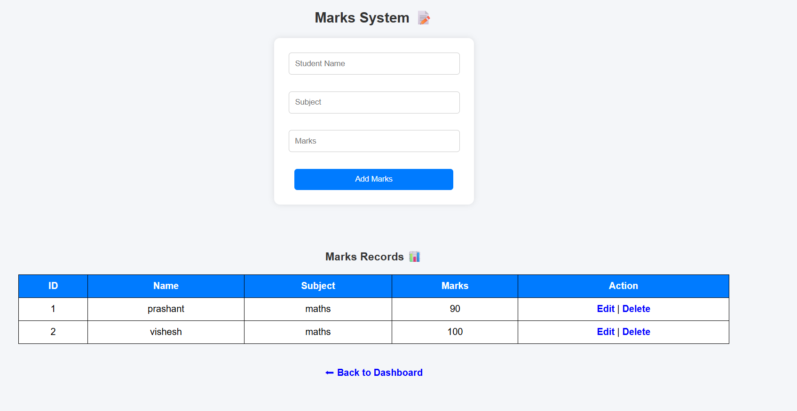
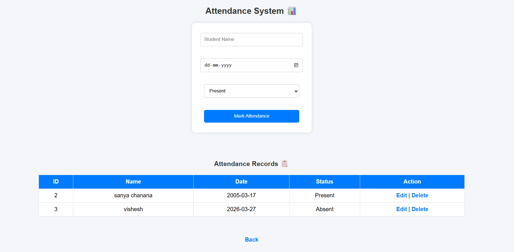

# 🎓 Mini ERP System (College Companion)

## 📌 Description
This is a Mini ERP (Enterprise Resource Planning) system built using PHP and MySQL.  
It helps manage student data, user authentication, and basic college operations.

---

## 🚀 Features
- 🔐 User Signup & Login
- 👨‍🎓 Student Management
- 📂 Database Integration (MySQL)
- 🎨 Simple UI using HTML, CSS

---

## 🛠️ Technologies Used
- PHP
- MySQL
- HTML
- CSS
- XAMPP (Local Server)

---

## ⚙️ How to Run the Project

1. Install XAMPP  
2. Copy project folder to: C:\xampp\htdocs\  
3. Start Apache & MySQL  
4. Import database:  
   - Open phpMyAdmin  
   - Create a database  
   - Import database.sql  
5. Open browser:  
   http://localhost/mini-erp/  

---

## 📸 Screenshots

### 🔐 Login Page

### 📊 Dashboard

### 📘 Attendance

### 📝 Marks

